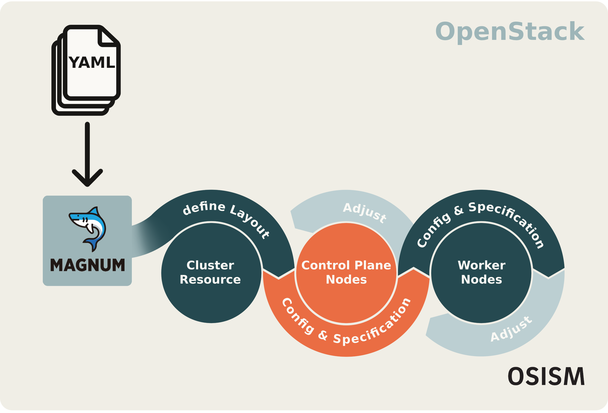

# Cluster API

Kubernetes as a Service (KaaS) is a cloud service model that simplifies the deployment,
management and scaling of Kubernetes clusters. By abstracting the underlying infrastructure,
KaaS allows organizations to focus on developing and deploying applications without the
complexities of cluster management. One of the most powerful tools for implementing KaaS
is the Cluster API, an official Kubernetes project that provides declarative APIs and tools
for managing the lifecycle of Kubernetes clusters.

## Benefits of Cluster API

* Declarative Cluster Management: Cluster API allows users to define the desired state of
  clusters using YAML manifests. This declarative approach simplifies the process of creating,
  updating, and deleting clusters, making it easier to automate and version control cluster
  configurations.
* Infrastructure Abstraction: Cluster API abstracts the underlying infrastructure, enabling
  the deployment of Kubernetes clusters across various environments, including public clouds
  (AWS, Azure, GCP), private clouds (OpenStack), and on-premises data centers. This abstraction
  ensures that the same API can be used regardless of the infrastructure provider.
* Consistent Lifecycle Management: Cluster API standardizes the lifecycle management of
  Kubernetes clusters, including provisioning, scaling, upgrading, and deletion. This consistency
  reduces operational overhead and ensures that clusters are managed uniformly across different
  environments.
* Extensibility and Customization: Cluster API’s modular architecture allows for extensibility
  through the use of custom resource definitions (CRDs) and controllers. Organizations can tailor
  the API to meet specific requirements, such as integrating with existing CI/CD pipelines or
  adding custom operational logic.
* Improved Operational Efficiency: By leveraging Cluster API, organizations can automate repetitive
  tasks, reduce human error, and ensure that clusters are configured according to best practices.
  This automation leads to increased operational efficiency and faster delivery of applications.

By using Kubernetes as a Service with Cluster API, organizations can achieve a highly automated,
scalable and consistent approach to managing Kubernetes clusters across different environments.
This allows them to focus more on application development, and less on the operational
complexities of managing Kubernetes infrastructure.

## Lifecycle Management of Cluster API in OSISM

### Cluster API with OpenStack Magnum

In an OpenStack environment, Magnum takes YAML-manifests to define and deploy
specifications for Kubernetes clusters. First, Cluster Resources get defined.
After that, Control Plane Nodes and Worker Nodes are configured. If there are
changes to the YAML-Manifests, Magnum will adjust the Nodes accordingly.

### Cluster API with SCS Cluster Stacks

SCS Cluster Stacks works in multiple cloud environments. It takes YAML-manifests
to define and deploy specifications for Kubernetes clusters. First, Cluster
Resources get defined. After that, Control Plane Nodes and Worker Nodes are
configured. If there are changes to the YAML-Manifests, SCS Cluster Stacks will
adjust the Nodes accordingly.

