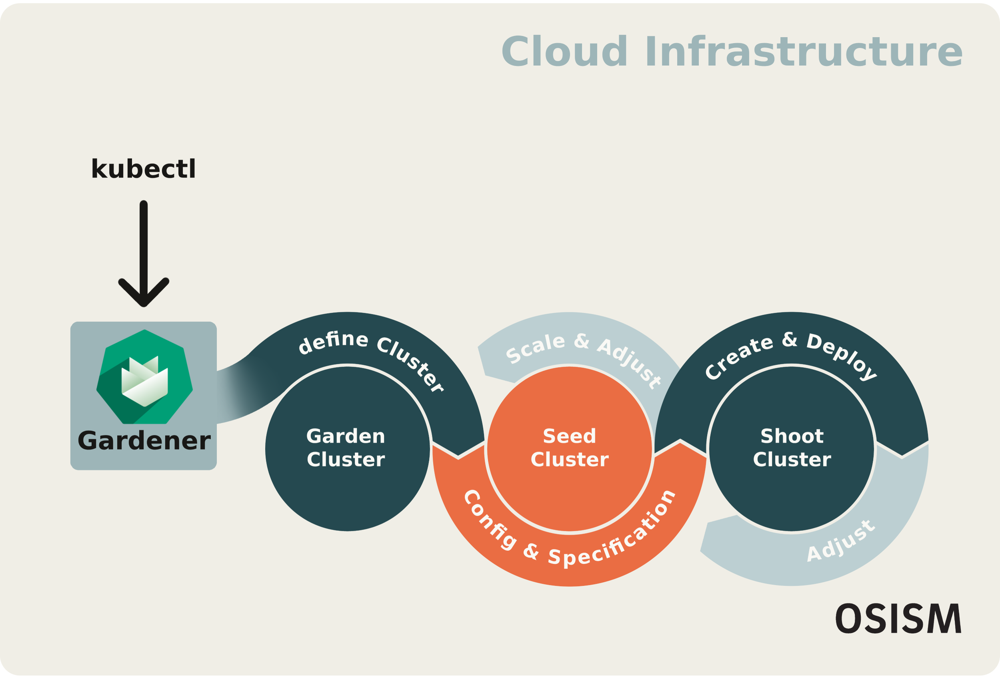

# Gardener

Gardener by SAP is an advanced Kubernetes as a Service (KaaS) solution that leverages a Kubernetes-native approach to manage Kubernetes clusters at scale. KaaS is a cloud service model that abstracts the underlying infrastructure, with KaaS you can simplify the deployment, management and scaling of Kubernetes clusters. Gardener is designed to provide consistent and efficient cluster management across various cloud environments and on-premises data centers.

## Key benefits of Gardener

* **Kubernetes-Native Design**: Gardener operates by treating Kubernetes natively. It uses Kubernetes itself to ochestrate the deployment and management of other Kubernetes clusters by logically deviding Cluster Resources, Control Plane nodes, and Worker nodes into Kubernetes clusters. Gardener will take the desired state, based on best practices, and create cluster(s) on your prefered cloud infrastructure provider and keep them running.
* **Shoot, Seed, and Garden clusters**:
  * Garden cluster: This is the center of Gardener's cluster hierarchy - from here all other clusters (Seed and Shoot) are managed.
  * Seed cluster: These clusters host, adjust, and manage the Control Plane nodes of Shoot clusters. Seed clusters make the scaling of Control Plane nodes easier.
  * Shoot clusters: These Worker nodes manage the user clusters, who run the workloads.
  * Workerless Shoots: Gardener offers Kubernetes clusters without nodes/pods, which only offer Control Plane features. These can be used for orchestration or managing Custom Resource Definitions (CRDs).
* **Multi-Cloud and Hybrid Cloud Support**: Gardener supports deployment across various cloud providers, including AWS, Azure, Google Cloud, and OpenStack, as well as on-premises environments. This multi-cloud capability allows for a consistent Kubernetes experience regardless of the underlying infrastructure.
* **Automated Cluster Management**: Gardener automates the lifecycle management of Kubernetes clusters, including provisioning, scaling, upgrading, and healing the system. This automation reduces operational overhead and ensures clusters are always running optimally.
* **High Availability and Resilience**: Gardener ensures high availability by distributing control planes across multiple seed clusters and leveraging cloud provider features to enhance resilience. This design minimizes downtime and enhances the reliability of managed clusters.
* **Extensibility and Customization**: Gardener’s architecture allows for customization and extensibility through extensions and webhooks. This flexibility enables organizations to tailor the solution to meet specific requirements and integrate with existing tools and processes.

By using Gardener by SAP for Kubernetes as a Service, organisations can achieve a scalable, automated and consistent approach to managing Kubernetes clusters across multiple environments. This allows them to focus on delivering business value through their applications, rather than dealing with the complexities of cluster management.

## Lifecycle Management of Gardener in OSISM

