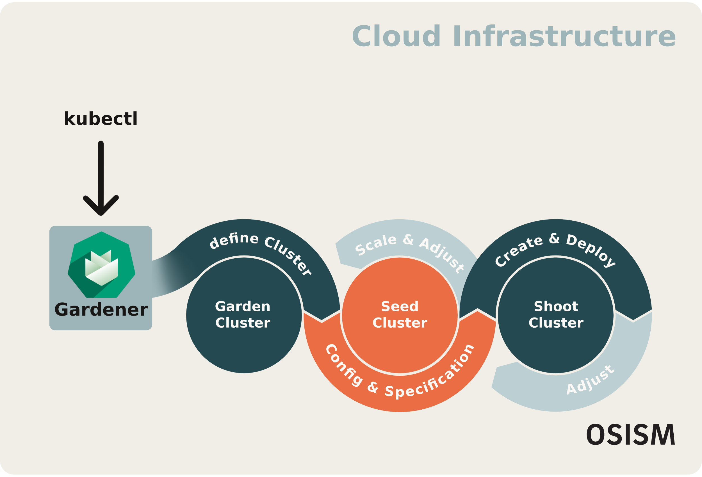

# Gardener

Kubernetes as a Service (KaaS) simplifies the deployment, management, and scaling of
Kubernetes clusters by abstracting the underlying infrastructure. Gardener by SAP is
an advanced KaaS solution that leverages a Kubernetes-native approach to manage
Kubernetes clusters at scale. Gardener is designed to provide consistent and efficient
cluster management across various cloud environments and on-premises data centers.

## Key benefits of Gardener

* Kubernetes-Native Design: Gardener operates by treating Kubernetes clusters as first-class
  citizens. It uses Kubernetes itself to orchestrate the deployment and management of other
  Kubernetes clusters, ensuring that all operations are consistent and follow Kubernetes best
  practices.
* Shoot, Seed, and Garden Clusters:
  * Shoot Clusters: These are the user clusters managed by Gardener, running the workloads.
  * Seed Clusters: These clusters host the control planes of shoot clusters and are managed by
    the Gardener infrastructure.
  * Garden Cluster: This is the central cluster where the Gardener components run and from which
    all other clusters (seed and shoot) are managed.
* Multi-Cloud and Hybrid Cloud Support: Gardener supports deployment across various cloud providers,
  including AWS, Azure, Google Cloud, and OpenStack, as well as on-premises environments.
  This multi-cloud capability allows for a consistent Kubernetes experience regardless of the
  underlying infrastructure.
* Automated Cluster Management: Gardener automates the lifecycle management of Kubernetes clusters,
  including provisioning, scaling, upgrading, and healing. This automation reduces operational
  overhead and ensures clusters are always running optimally.
* High Availability and Resilience: Gardener ensures high availability by distributing control
  planes across multiple seed clusters and leveraging cloud provider features to enhance resilience.
  This design minimizes downtime and enhances the reliability of managed clusters.
* Extensibility and Customization: Gardener's architecture allows for customization and extensibility
  through extensions and webhooks. This flexibility enables organizations to tailor the solution to
  meet specific requirements and integrate with existing tools and processes.

By using Gardener by SAP for Kubernetes as a Service, organizations can achieve a scalable,
automated and consistent approach to managing Kubernetes clusters across multiple environments.
This allows them to focus on delivering business value through their applications, rather
than dealing with the complexities of cluster management.

## Lifecycle Management of Gardener in OSISM

Gardener takes the input from kubectl (or any other input source), and builds
and deploys a Kubernetes cluster based off the provided parameters.

