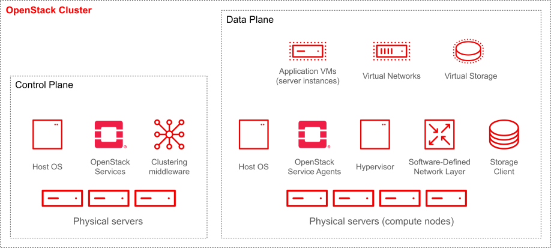
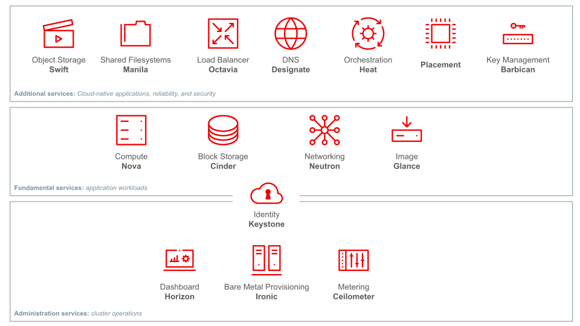
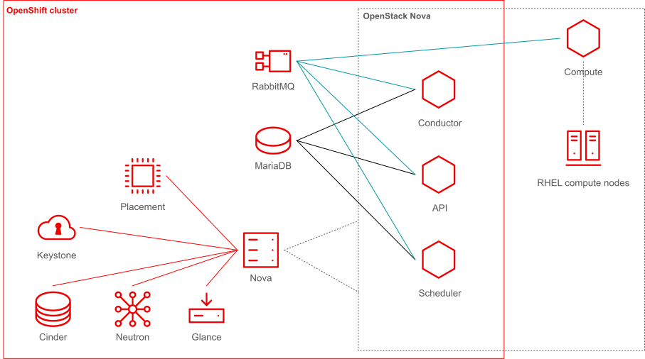
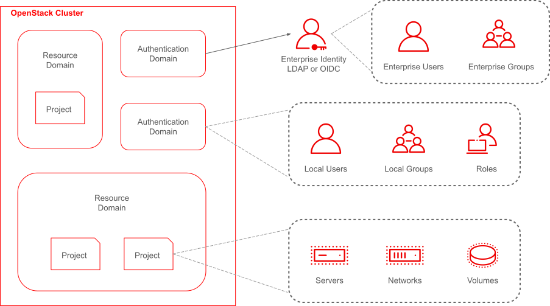

# OpenStack

## Lifecycle Management of OpenStack in OSISM

The open source project Kolla from the [OpenInfra Foundation](https://openinfra.dev) is
used in OSISM for the life cycle management of OpenStack. Kolla’s mission is to provide
production-ready containers and deployment tools for operating OpenStack clouds. Kolla has
been actively developed by a very diverse team for 10 years and is one of the most common
(if not the most common) life cycle management tool for OpenStack.

The container images provided by Kolla are not only used by Kolla itself. They are also used
in TripleO, the basis for the now discontinued
[RedHat OpenStack Platform](https://www.redhat.com/en/technologies/linux-platforms/openstack-platform),
and the [OpenStack Kubernetes Operators](https://github.com/openstack-k8s-operators),
the basis for the new
[RedHat OpenStack Services on OpenShift](https://www.redhat.com/en/blog/red-hat-openstack-services-openshift-next-generation-red-hat-openstack-platform).

## OpenStack cluster

Image source: [Introduction to Red Hat OpenStack Services on OpenShift](https://redhatquickcourses.github.io/rhoso-intro/rhoso-intro/1/ch1-intro/s1-rhoso-lecture.html)

## OpenStack services architecture

Image source: [Introduction to Red Hat OpenStack Services on OpenShift](https://redhatquickcourses.github.io/rhoso-intro/rhoso-intro/1/ch2-services/s1-fundamental-lecture.html)

* Swift: Object Storage
* Manila: Shared Filesystems
* Octavia: Load balancer
* Designate: DNS
* Placement
* Barbican: Key Management
* Nova: Compute
* Cinder: Block Storage
* Neutron: Networking
* Glance: Image
* Horizon: Dashboard
* Ironic: Bare Metal Provisioning
* Ceilometer: Metering

# General architecture of OpenStack services

Image source: [Red Hat OpenStack Services on OpenShift Architecture](https://redhatquickcourses.github.io/rhoso-arch/rhoso-arch/1/ch1-architecture/s6-services-lecture.html)

# Multitenancy with OpenStack

Image source: [Introduction to Red Hat OpenStack Services on OpenShift](https://redhatquickcourses.github.io/rhoso-intro/rhoso-intro/1/ch3-multitenancy/s1-domains-projects-lecture.html)
