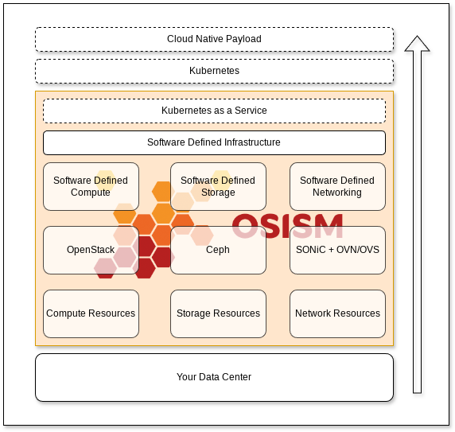

# Concept Guide

:::info

The Concept Guide is currently under construction. Therefore, there are still
many empty sections that have already been created for the overall structure.
If there are requests for certain sections or if existing sections are not
understandable or need more details, please open an [issue](https://github.com/osism/issues/issues).
Contributions are welcome, and they are greatly appreciated. Open Source Software
and Documentation relies on contributions.

:::

## Highlevel Overview

## Components in a cloud pod

* [Infrastructure as a Service (IaaS) with OpenStack](./components/openstack)
* [Software Defined Storage (SDS) with Ceph](./components/ceph)
* [Bare Metal as a Service (BMaaS) with Ironic](./components/ironic)
* [Software Defined Networking (SDN) with SONiC & OVN](./components/sonic)
* [Kubernetes (K8s) with K3S](./components/k3s)
* [Kubernetes as a Service (KaaS) with Gardener](./components/gardener)
* [Kubernetes as a Service (KaaS) with Cluster API](./components/clusterapi)
* [Identity & Access Management with Keycloak](./components/keycloak)
* [Privileged Access Management (PAM) to all infrastructure with Teleport](./components/teleport)
* [Logging, Monitoring & Telemetry with Prometheus & Grafana](./components/prometheus)
* [Realtime insights with Netdata](./components/netdata)

## Requirements

## Layers in a cloud pod

* [Compute Plane](./layers#compute-plane)
* [Control Plane](./layers#control-plane)
* [Data Plane](./layers#data-plane)
* [Management Plane](./layers#management-plane)
* [Monitoring Plane](./layers#monitoring-plane)
* [Network Plane](./layers#network-plane)

## Reference architecture

* [Manager architecture](./architecture#manager-architexture)
* [Control architecture](./architecture#control-architecture)
* [Compute architecture](./architecture#compute-architecture)
* [Storage architecture](./architecture#storage-architecture)
* [Network architecture](./architecture#network-architecture)
* [Routing architecture](./architecture#routing-architecture)
* [Firewall architecture](./architecture#firewall-architecture)
* [Loadbalancer architecture](./architecture#loadbalancer-architecture)
* [Logging architecture](./architecture#logging-architecture)
* [Monitoring architecture](./architecture#monitoring-architecture)
* [Identity architecture](./architecture#identity-architecture)

## Use cases

* [Hyper-converged infrastructure (HCI)](./use-cases#hyper-converged-infrastructure-hci)

## Bill of Materials

* [Control nodes](./bom#control-nodes)
* [Compute nodes](./bom#compute-nodes)
* [Storage nodes](./bom#storage-nodes)
* [Network nodes](./bom#network-nodes)
* [Manager nodes](./bom#manager-nodes)
* [Switches](./bom#switches)
* [Network interface cards](./bom#network-interface-cards)
