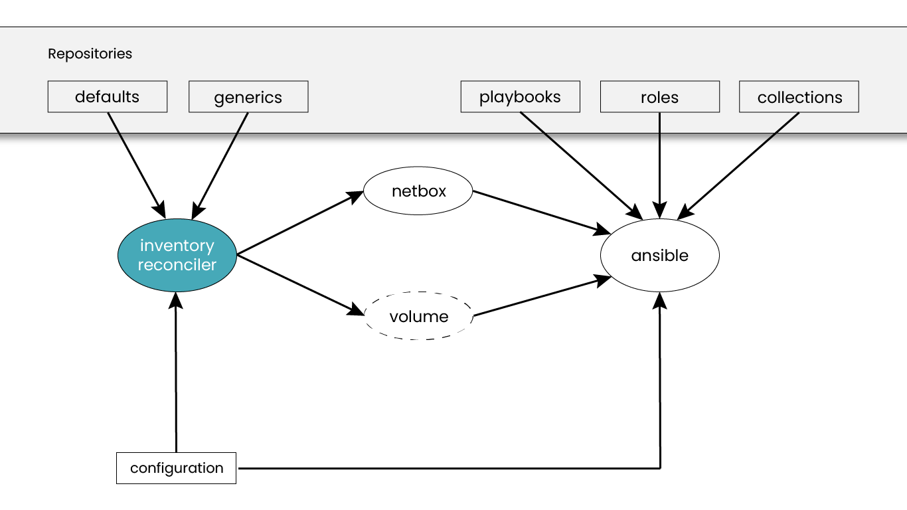

# Inventory

The inventory used for the environment is located in the `inventory` directory.

How an inventory works is described in detail in the [Ansible documentation](https://docs.ansible.com/projects/ansible/latest/inventory_guide/intro_inventory.html).
In this chapter, we only deal with special features in the context of OSISM.

## Host names

A host's name in the inventory decides the name the machine is given, and every
component that looks a host up by name has to arrive at the same answer. Use one
form throughout the inventory:

- **Short names**, such as `node01`. This is the default: the machine is named
  after the first label of its inventory name.
- **Fully qualified names**, such as `node01.example.com`, together with
  `hostname_use_fqdn: true`. The machine is then named with the whole name.

The combination to avoid is fully qualified inventory names *without*
`hostname_use_fqdn`. Each machine then answers to `node01` while the network
answers with `node01.example.com`. Components differ in which of the two they
use, so anything that looks a host up by name can miss. Nova's compute identity,
nova-compute's authentication to libvirt, and OVN port binding are each known to
break this way.

The remaining rules are checked while the hosts are bootstrapped, and a
deployment that breaks one is refused:

- A name is at most 64 bytes, the kernel's limit.
- A name is lowercase.
- No two hosts end up with the same name. Fully qualified names that differ only
  after the first label, such as `node01.dc1.example.com` and
  `node01.dc2.example.com`, collide under the default, because only the first
  label is used.
- Each host can resolve its own name.

Decide this before deploying. Nova stores the name it first saw for a compute
and cannot rename one, so changing the form afterwards is not a configuration
change.

## Manager

The manager has his own inventory which is used exclusively for the seed phase of the manager.
It is located in the directory `environments/manager`. There is a `hosts` file with only the
manager node in it.

## Reconciler

## Host Vars

## Group Vars

### Define variable for all nodes

The Ansible group `all` is specifically used internally by OSISM, is reserved and is not supported
for additional variables. When variables are added in the configuration repository for the all group,
they are ignored. In OSISM the group `generic` can be used to store variables for all nodes.
