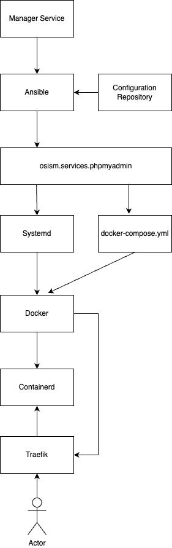
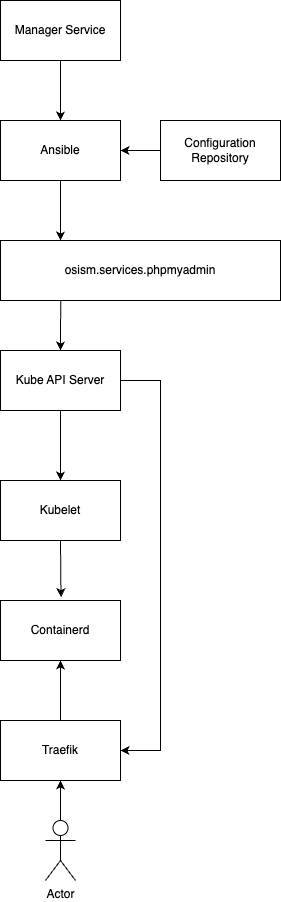

# Developer Guide

We welcome any issues, change requests or general feedback. Do not hesitate to [open an issue](https://github.com/osism/issues/issues/new).

We use GitHub Issues to capture feature requests, feedback, bugs, etc. The tracker is available in the
[osism/issues](https://github.com/osism/issues/issues) repository. There are no specific requirements for the creation of an issue.
Error cases should be described in such a way that they are directly reproducible. The more outputs there are,
the better.

We use GitHub pull requests for contributions. The use of pull requests is documented in the
official [GitHub documentation](https://docs.github.com/en/github/collaborating-with-pull-requests).
The process in detail for the creation of a fork, branch etc. is also documented in the
official [GitHub documentation](https://docs.github.com/en/github/collaborating-with-pull-requests/proposing-changes-to-your-work-with-pull-requests).
It is recommended to use the [GitHub CLI](https://cli.github.com). Makes many steps easier.

## How to add a new service

If you want to add a new service to OSISM, this is done via an Ansible role and (most often)
a container image. The following steps are necessary and are demonstrated using the example
of `osism.services.cgit`.

| Description                                                                         | Example                                                                |
|:------------------------------------------------------------------------------------|:-----------------------------------------------------------------------|
| Add the Ansible role in one of the Ansible collection repositories                  | https://github.com/osism/ansible-collection-services/pull/578/files    |
| Add the Ansible playbook                                                            | https://github.com/osism/ansible-playbooks/pull/215/files              |
| Add the Ansible inventory group                                                     | https://github.com/osism/cfg-generics/pull/225/files                   |
| Add the used container image(s) to the release repository                           | https://github.com/osism/release/pull/278/files                        |
| Add the container images(s) to osism-ansible container image                        | https://github.com/osism/container-image-osism-ansible/pull/215/files  |
| Add the container image registry/registries and host(s) to the defaults repository  | https://github.com/osism/defaults/pull/54/files                        |
| Add a sample deployment to the testbed                                              | https://github.com/osism/testbed/pull/1043/files                       |

## How to add a new container image

If required, add a new container image in the [osism/container-images](https://github.com/osism/container-images)
repository. The example here is from the `osism.services.keycloak` role: https://github.com/osism/container-images/pull/34/files.

Whenever possible, upstream container images should be used. If only minor customizations are necessary,
always work with overlay container images based on upstream container images.

## How service deployment works

### Docker

### Kubernetes

