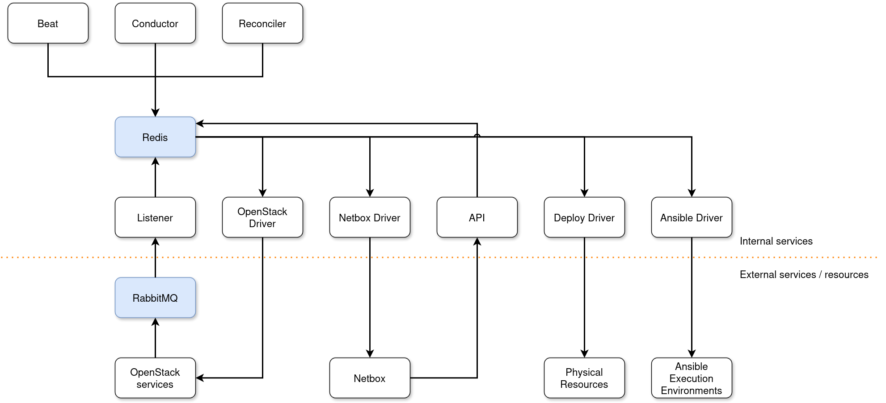

# Manager

## Architecture View

As you can easily guess from the name "manager", this is responsible for managing an entire OSISM installation. 
The following diagram provides an overview of the components involved.



## OSISM Usage

### Get help for OSISM commands

```
osism help
osism help apply
```

### Update the configuration

Once the manager has been deployed and the configuration repository has been initially transferred to the manager node,
the configuration repository can be updated using osism apply configuration.

Configuration changes are typically staged in a clone of the configuration repo to have versioning of changes.

```
cd /opt/configuration
git pull
osism apply configuration
```

:::warning
If local changes were made directly in the configuration repository on the manager node, these are overwritten without asking.
:::
